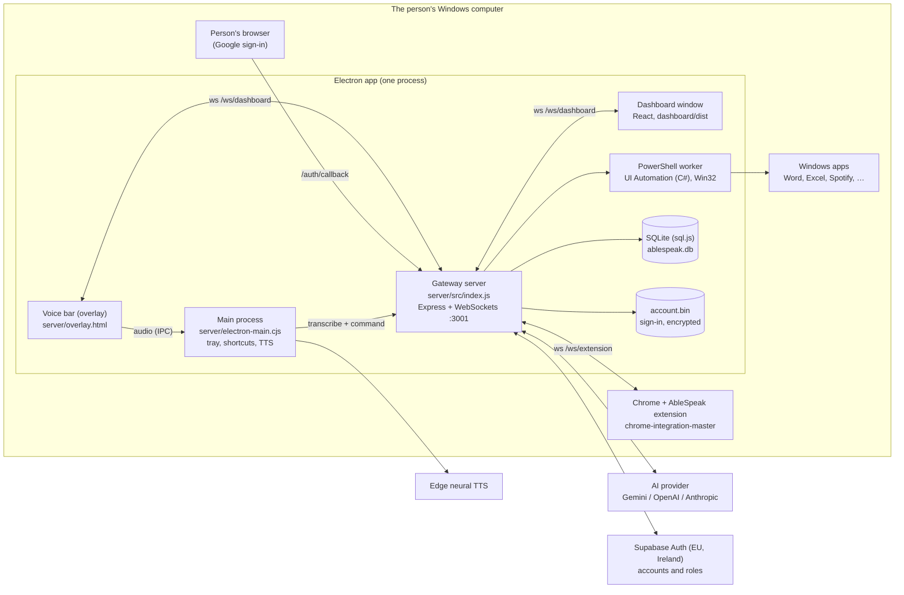
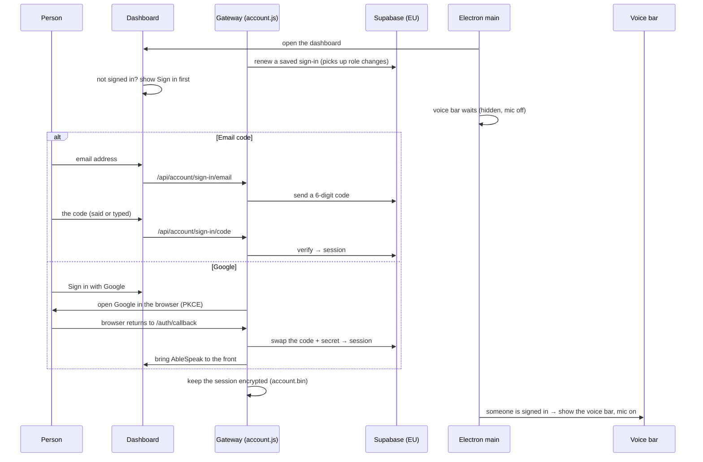
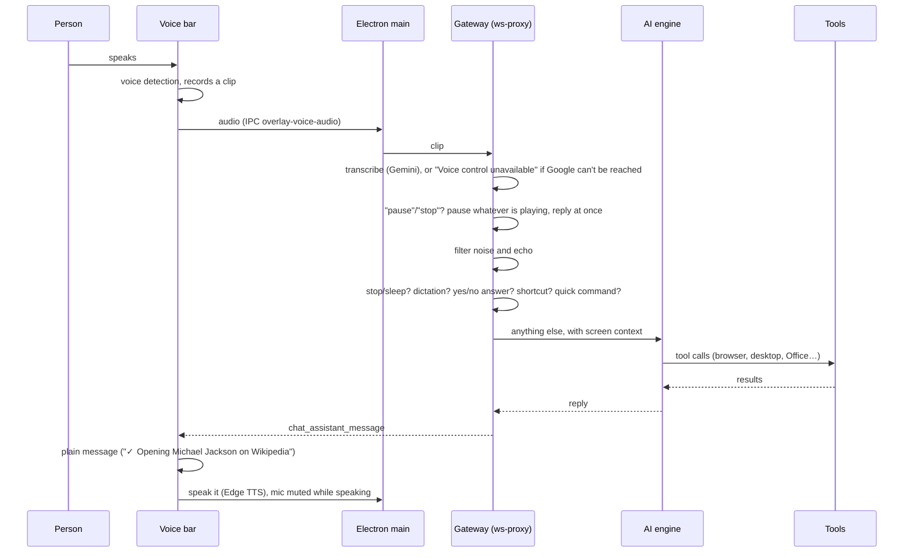

# AbleSpeak Full Computer Nav — design

*How the AbleSpeak Tier 2 desktop app works today (5 October 2026, evening). For engineers and technical co-founders. Code lives in `tier2/ablespeakdesktop/`.*

AbleSpeak lets a person who can't use a keyboard or mouse well run a Windows computer by voice: open and switch apps, browse the web, click anything on screen, type and dictate, read documents aloud, and fix mistakes. It is a **personal tool**: each person signs in to their own AbleSpeak account (email code or Google), sees only their own progress, and starts using their voice once signed in. Pages are split into three tiers — **User**, **Helper** and **Admin** — opened by the account's role or by a PIN.

---

## 1. The system at a glance

| Part | What it is | Where |
|---|---|---|
| **Electron app** | One desktop process that hosts everything below; tray icon, global shortcut (Ctrl+Shift+A), speech output | `server/electron-main.cjs` |
| **Voice bar (overlay)** | Small always-on-top window: mode, what was heard, the outcome | `server/overlay.html`, `server/overlay-messages.js`, `server/overlay-preload.cjs` |
| **Gateway server** | Node/Express on `localhost:3001`; the brain: voice pipeline, AI, tools, accounts, data | `server/src/` |
| **PowerShell worker** | One long-lived PowerShell process with compiled C# for Windows UI Automation, input, windows and media | `server/src/system-tools.js`, `server/src/uia/*-cs.js` |
| **Dashboard** | React + Vite + Tailwind pages served by the gateway; opens on **Sign in** | `dashboard/` (built to `dashboard/dist`) |
| **Chrome extension** | Reads and drives web pages; talks to the gateway over a WebSocket | `chrome-integration-master/` |
| **Database** | SQLite through sql.js (pure JS), saved to a file | `server/src/db.js` |
| **Accounts** | Supabase Auth in the EU: email-code and Google sign-in, roles | `server/src/account.js` |

---

## 2. Starting AbleSpeak and signing in

- **Sign in comes first.** Until an account is signed in, every launch opens on the sign-in page and other pages lead back to it (`dashboard/src/lib/signInFirst.js`). **"Not now — keep using this computer only"** skips it until the next start, because sign-in needs the internet and must never lock someone out of their own computer.
- **The voice bar waits.** Electron checks `/api/account/status` every 2 seconds; the bar appears, and only then switches its microphone on, once someone signs in or chooses "Not now". Signing out hides it again. Ctrl+Shift+A and the tray still show it by hand.
- **Email code:** no password. Supabase emails a code (the Magic Link and Confirm signup templates carry `{{ .Token }}`); the person says or types it.
- **Google:** through the person's normal browser with **PKCE** — a one-time secret made and kept on this computer — so a code reaching `/auth/callback` by any other route is useless. Each sign-in works once and expires in 10 minutes. The callback page is styled in AbleSpeak's look and the app comes back to the front.
- **The session** is kept by the server only, in `account.bin` next to the database, encrypted with Windows' own protection (Electron `safeStorage`). The dashboard never sees tokens; they are never written to `.env` or the logs. On each start the sign-in is renewed; a refused renewal signs out here too, and no internet keeps the saved sign-in.
- **Roles come from Supabase**, in the user's `app_metadata.ablespeak_role` (`admin` or `helper`), which only the project owner can set (SQL editor), never the user. Example: `update auth.users set raw_app_meta_data = coalesce(raw_app_meta_data,'{}'::jsonb) || '{"ablespeak_role":"admin"}'::jsonb where email = '…';`
- **Config:** `SUPABASE_URL` and `SUPABASE_PUBLISHABLE_KEY` in `.env` (the publishable key is meant to ship in apps; the secret key never comes near this code). Project: "Computer- Control Ablespeak", West EU (Ireland). Google sign-in also needs the Supabase **Redirect URL** `http://127.0.0.1:3001/auth/callback` and a Google OAuth client (test users while in Testing).

---

## 3. From speaking to action

1. **Listening.** Once shown, the voice bar listens all the time (or until put to sleep). It measures sound levels, starts a clip on speech and ends it after a pause; sensitivity, pause length and **automatic gain** come from the person's listening profile (`student-profile.js`):
   - *Standard* and *Quiet voice* keep the microphone's automatic gain on, for soft speakers;
   - *Noisy room* turns it **off** (it turns up distant voices too) and drops the "say it louder" prompt, which there is mostly set off by other people talking.
   While AbleSpeak is speaking the mic is muted; a watchdog timed from playback re-opens it if the "finished speaking" signal is lost.
2. **Transcription.** `voice-handler.js` sends the clip to Gemini Flash with a strict "words only, otherwise SILENCE" prompt plus the person's own vocabulary. Made-up text, noise and AbleSpeak's own voice are filtered out (`safety.js`).
   - Each request gives up after 12 seconds; one retry rides out a short blip.
   - If Google can't be reached, the voice bar says "Voice control unavailable — AbleSpeak needs the internet right now. I'll reconnect automatically." once, shows it until the next phrase is heard, and those turns are logged as `offline`, not as recognition errors.
3. **Emergency pause.** A short phrase (six words or fewer) with "pause", "stop", "mute", "quiet", "silence", "hush" or "shut up" pauses whatever is playing, before any other filter:
   - `pauseAllMedia()` (`system-tools.js`) uses Windows' own media controls, so it reaches Spotify, Chrome, VLC or any player, and only ever pauses — never starts music;
   - a browser tab Windows doesn't list falls back to the Chrome extension;
   - the person hears what happened ("Paused Spotify.", "Nothing is playing."), and it counts as a command.
4. **Routing** (`ws-proxy.js: _handleUtterance`), in this order:
   1. stop / sleep / wake / hide / come back — always answered (while asleep, everything except "wake up" is ignored, and the voice bar no longer shows what it ignored);
   2. dictation — words are typed into the window chosen when dictation started (Word and Excel through COM, everything else by paste); the voice bar keeps showing that window;
   3. a pending yes/no question (consequential actions ask first);
   4. corrections ("no, I meant…"), the person's own shortcuts and routines;
   5. **quick commands** (`fast-commands.js`): scroll, go back, open an app, switch window, media keys — no AI;
   6. **multi-step tasks** (`agent.js`): plan → act → check the screen → re-plan;
   7. everything else goes to the **AI engine**.
5. **AI engine** (`ai-engine.js`): builds a system prompt with what's on screen, calls the chosen provider (OpenAI, Gemini or Anthropic; Gemini with thinking off), runs the returned tool calls (up to 3 rounds), never repeats an identical failed call, and summarises the outcome. When several links are followed in one command, the summary keeps the first — the link the person asked for.
6. **Reply.** The gateway saves the command (who, outcome, latency) for progress, broadcasts it, and the voice bar turns it into plain words (section 5).

---

## 4. How AbleSpeak sees and acts

### In the browser (Chrome extension)
- The extension (`service-worker.js`) keeps a WebSocket to `/ws/extension`, pushes the active tab's visible elements, and runs commands: open, close and switch tabs; navigate; click; open a link by what was said (matched word by word against link text and address); scroll the page or whichever inner panel actually scrolls; take a tab screenshot.
- It acts on the active tab of the last-used normal Chrome window, never on AbleSpeak's own dashboard.
- **Following a link** reports what is opening, not the address: "Opening Michael Jackson on Wikipedia." (`spokenPageName` in `tool-registry.js`); the address is kept in a separate field for the AI.
- **Media (play, pause, seek, volume)** tries the tab the person is looking at first, then tabs making sound, then other media sites; it skips Chrome's own pages and suspended tabs and moves to the next tab when one can't be controlled. If a site refuses to start playback, it says so ("Try 'click play'"). *After changing the extension, reload it in `chrome://extensions`.*

### On the desktop (Windows UI Automation)
- **Screen model** (`screen-model.js` + `uia/screen-model-cs.js`): one cached read of the front window's controls — name, type, position, state and which actions each supports. The AI acts on a control by its ref (`uia_act`): press, toggle, select, expand or collapse, type a value, scroll, move a slider (`set_range`), focus, or read text (all, selection, word, line, paragraph or page).
- **Focus events:** a background handler counts keyboard-focus changes; a cached read is thrown away as soon as focus moves.
- **Office** (`office-uia.js` + `uia/office-uia-cs.js`): a small UIA3 client reads Excel's and Word's own accessibility properties — a cell's formula, number format and table position; Word's spelling errors and suggestions. `fix_spelling` asks Word itself to apply a suggestion.
- **Fallbacks:** mouse clicks at coordinates, keystrokes, and a desktop screenshot the AI can look at.
- All of this runs in **one PowerShell worker** started at launch (C# compiled once), so a desktop action takes tens to hundreds of milliseconds.

### Tools
56 tools are registered (`tool-registry.js`, grouped in `tool-catalog.js`). The AI is offered only the tools that fit the moment (for example, no browser tools while the extension is disconnected).

---

## 5. The voice bar

Built to the UI/UX spec's Phase 1: the person always knows what AbleSpeak is doing, in plain words.

- **Compact by default** (about 123 × 61 px): grip, mic, one status line, show-more arrow. The window is exactly the bar's size, so it never blocks clicks around it. **Movable:** drag by the grip; it snaps to a nearby edge and remembers its place (`overlay-position.json`).
- **Mode label** (expanded panel, and the screen-reader name "AbleSpeak. Listening."): Listening, Working, Dictation, Please confirm, Speaking, Sleeping, Voice unavailable, Didn't work — a word and a colour, never colour alone.
- **Plain messages** (`overlay-messages.js`, tested on its own):
  - results say what happened ("✓ Paused Spotify", "✓ Opening Michael Jackson on Wikipedia"), falling back to "✓ Done" only for long or technical replies;
  - failures say what went wrong and what to try ("I can't control this webpage right now. Check that Chrome is open, then try again."); technical errors are translated, and the raw text goes to the log as `[Overlay] Failure shown as … — was: …`;
  - web addresses are never shown or read out — only the site's name.
- **Buttons for what can also be said:** **Yes / No** for a confirmation (kept open until answered), **Stop dictation** while dictating. They send the same words as speech would.
- **Expands by itself** for a failure (a few seconds) or a question (until answered); the person can pin it open or closed.
- **Asleep stays quiet:** it shows "Sleeping — say 'wake up'" and not the clips it ignores.
- **The red stop button** (while speaking) only ever stops the speech, never the mic.
- **Logging:** warnings, errors and mic events (`Shown — starting the mic`, `Mic turned off (mic button / Esc key)`) are copied into the app log as `[Overlay] …`.

---

## 6. Who the user is, and what's stored

- **The account** (section 2) says who is signed in and their role. **On this computer**, AbleSpeak also opens the local profile linked to the Windows account, creating it the first time (`student-session.js`); profile sync to the account is the next Phase 2 step. Code and data still say "student"; people see "user".
- **Shared computers:** an admin can mark a computer as shared. Then (and on guest-type Windows accounts) no profile opens by itself and the last person never carries over (`shared-computer.js`).
- **Profile** (`student_profiles`): listening sensitivity and pause, the person's own words, shortcuts and routines. It can be saved to a file and loaded on another computer.
- **Database tables:** `students`, `student_profiles`, `sessions`, `commands` (every command with outcome and latency), `voice_turns` (every clip: command, dictation, control, no speech, filtered, error or offline), `correction_pairs`, `resolution_log`, `goals`, `progress_points`, `phase_changes`, `decision_flags`, `health_checks`, `log_events`, `device_state`. Deleting a person removes their rows from all of them.
- **My progress** reads `GET /api/students/:id/progress` (commands and successes per day, and what they say most).

---

## 7. Access: User, Helper, Admin

The sidebar always shows the three tiers, so the split is visible; locked pages show a lock and lead to the PIN screen.

| Tier | Pages | Opened by |
|---|---|---|
| **User** | Home, My progress, Voice & words, Sign in | everyone |
| **Helper** | Users (people, goals, progress) | a signed-in account with role `helper`, or the **helper PIN** |
| **Admin** | Users, Test console, Developer Hub, Settings | a signed-in account with role `admin`, an **admin Windows account**, or the **admin PIN** |

- **Admin PIN** (`admin-pin.js`): the first one can only be set from the tray ("Set admin PIN…"), so nobody can make themselves admin by voice. PIN unlocks last 15 minutes; five wrong PINs lock unlocking for five minutes.
- **Helper PIN:** optional, set by an admin in Settings; never the same as the admin PIN.
- **Admin Windows account** (`admin-account.js`): on the admin's own computer, the tray item "Admin pages without a PIN…" (or Settings → Admin account) opens every page for that Windows account. Refused on shared computers and guest accounts.
- **Order of checks:** an admin account (Windows or signed-in) first, then a PIN's token, then a signed-in helper. A role from an account can't be locked; a PIN can.
- **Other websites never get a role:** the gateway allows any origin, so account-based roles and every `/api/account` route apply only to requests marked as coming from AbleSpeak's own pages (`Sec-Fetch-Site` / `Origin`, `fromOwnPages`).
- **Not yet:** the Users page's data routes (`/api/students/*`) are not role-checked on the server, because My progress and Voice & words share some of them; only the page is gated.

---

## 8. Safety and privacy

- **Asks before consequential actions** (delete, send, buy, close with unsaved work…), and ignores its own question if the microphone hears it read back.
- **Local only:** the gateway listens on localhost; both WebSockets check a token and the origin; account and admin routes refuse other websites.
- **Sign-in data:** tokens stay on the server, encrypted with Windows' protection; Supabase (EU) holds the account (email) and role.
- **What leaves the computer:** voice clips go to Gemini for transcription; commands, page elements, screen summaries and sometimes screenshots go to the chosen AI provider; spoken replies go to Microsoft's Edge TTS; sign-in goes to Supabase (and Google, if chosen). Phase 2 sync will send only settings, words, shortcuts and daily numbers — never recordings, transcripts or screenshots.

---

## 9. Channels

| Channel | Between | Used for |
|---|---|---|
| `http://localhost:3001/api/*` (also `/api/settings`, `/api/admin`, `/api/account`) | dashboard ↔ gateway | data, settings, progress, PINs and roles, sign-in |
| `http://127.0.0.1:3001/auth/callback` | person's browser → gateway | the end of Google sign-in |
| `ws://localhost:3001/ws/dashboard` | dashboard, voice bar ↔ gateway | commands, live status, replies |
| `ws://localhost:3001/ws/extension` | Chrome extension ↔ gateway | page context, browser tools |
| Electron IPC | voice bar ↔ main process | audio, speech, window size and position |
| stdin/stdout | gateway ↔ PowerShell worker | UI Automation, Win32 and media scripts |
| HTTPS | gateway → Supabase, Gemini, AI provider | sign-in, transcription, commands |

---

## 10. Where things are

| To change… | Look in |
|---|---|
| What happens to something said | `server/src/ws-proxy.js` (`_handleUtterance`) |
| Instant commands | `server/src/fast-commands.js` |
| The AI prompt and tool loop | `server/src/ai-engine.js` |
| A tool | `server/src/tool-registry.js` (+ `tool-catalog.js`) |
| Desktop reading and acting | `server/src/screen-model.js`, `server/src/uia/screen-model-cs.js` |
| Office details, spelling | `server/src/office-uia.js`, `server/src/uia/office-uia-cs.js` |
| Windows input, apps, dictation, media | `server/src/system-tools.js` |
| Speech recognition, offline detection | `server/src/voice-handler.js` |
| Listening profiles (levels, pause, gain) | `server/src/student-profile.js` |
| Sign-in, accounts, roles | `server/src/account.js`, `dashboard/src/pages/SignIn.jsx`, `dashboard/src/lib/signInFirst.js` |
| PINs, admin account, tiers | `server/src/admin-pin.js`, `server/src/admin-account.js`, `dashboard/src/components/AdminGate.jsx`, sidebar in `dashboard/src/App.jsx` |
| Confirmations, echo and noise filters | `server/src/safety.js` |
| Multi-step tasks | `server/src/agent.js` |
| Local profiles, shared computers | `server/src/student-session.js`, `server/src/shared-computer.js` |
| Data | `server/src/db.js` |
| Voice bar look and words | `server/overlay.html`, `server/overlay-messages.js`; when it shows: `server/electron-main.cjs` |
| Dashboard pages and look | `dashboard/src/pages/`, `dashboard/src/lib/ui.js` |
| Browser actions | `chrome-integration-master/service-worker.js` |

**Tests:** `cd server && npm test` (382 tests, including real UI Automation checks on Windows and a fake Supabase for sign-in). Dashboard: `cd dashboard && node scripts/check-page.mjs <file>` and `npm run build`.

---

## 11. Speed (measured 5 October 2026)

| Step | Time | Notes |
|---|---|---|
| Waiting for the person to stop speaking | about 1–1.5 s | the profile's pause; slow speakers need it |
| **Speech recognition (Gemini)** | **about 2.0–2.3 s** | same with thinking on or off, `2.5-flash` or `2.5-flash-lite`; about 0.65 s is the round trip to Google |
| The action | 50 ms – 1.5 s | quick commands are milliseconds; AI commands add about 1.5 s |

So even "scroll down" feels like about 3 seconds, mostly recognition. Planned, best first: (1) recognise quick commands on the computer with Windows' offline speech recognition (about 0.3 s, and they work without internet); (2) smaller voice clips (lower bitrate) for faster uploads; (3) live streaming to Gemini while the person speaks.

---

## 12. Known limits and what's next

- **Speed:** see section 11.
- **No offline speech recognition.** With no internet the person loses voice control (they are told so). Section 11's on-computer quick commands would also cover this.
- **Noisy rooms:** the *Noisy room* profile and the emergency pause help; **press-to-talk** is the real fix for busy rooms (founder decision).
- **Profile sync** to the account is the next Phase 2 step; today a profile moves between computers only as a file. See [AbleSpeak-Tier2-Phase2-Accounts-Plan.md](AbleSpeak-Tier2-Phase2-Accounts-Plan.md).
- **Email codes** use Supabase's built-in email, which only reaches project team members and a few messages an hour; real users need a custom SMTP sender.
- **Screen reading for blind users** is to be tested as a scripted session (what's on screen, read the page, links, focus, Word), then the worst gaps fixed.
- **Server-side role checks** for `/api/students/*` (section 7).
- **Windows and Chrome only.** No macOS, no other browsers, no mobile app yet (an Android app is being explored).
- **The voice bar has no Content-Security-Policy yet** (Electron warns about it).
- **Word through COM** uses whichever Word instance Windows registers first; with several Word windows open, dictation and spelling fixes can land in the wrong one.
